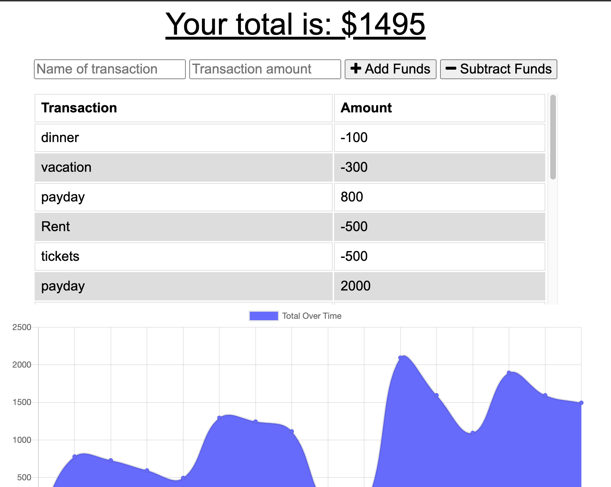

# Budget Trackers

  
  ## Table of Contests
  -[Description](#description)
  -[Instalation](#install)
  -[Usage](#usage)
  -[Licences](#licences)
  -[Contribution](#contribution)
  -[Test](#tests)
  -[Question](#questions)
  
  
  ## Description
    For anyone having issues with money management this app is a simple fix for you. Simply add in your paycheck as well as deduct your spendings to keep track of where your money is going. The storage will work online or offline.
  ## Install

  npm install
  
  ## Usage

  Use to keep your finances in order.
  
  
  ## Licence

  None
  
  ## Contribution
  Chris Ferguson
  
  ## Test
  
  NA
  
  ## Questions

  ### [cfergus7 GitHub](https://github.com/)  
  
  ### Email cfergus7@gmail.com

  ### https://classique-moliere-19367.herokuapp.com/

  ## Screen Shots
  

  ## Demo
  
  
